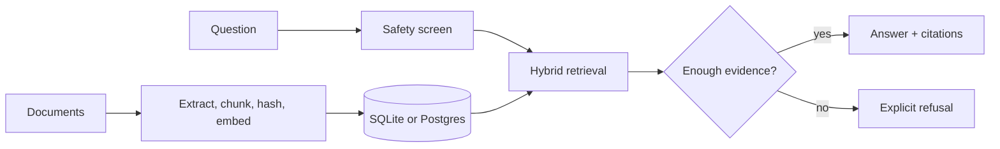

# Grounded Knowledge Platform

**Answers that show their work—or refuse.**

[](https://github.com/ryne2010/grounded-knowledge-platform/actions/workflows/ci.yml)

Grounded Knowledge Platform is a citations-first retrieval system for small document collections. It ingests text, Markdown, PDF, and tabular files; combines lexical and vector search; and returns evidence with each answer. When the indexed sources do not support an answer, the API returns an explicit refusal.

The default path runs locally without an external model or API key. SQLite, deterministic hash embeddings, and extractive answering make the trust boundary easy to inspect before adding managed infrastructure or a generative provider.

## Why it exists

A useful knowledge system needs more than a plausible response. It needs to explain where the response came from, behave predictably when retrieval fails, and preserve enough history to diagnose a regression.

| Risk | Implemented control |
| --- | --- |
| Unsupported answer | Citations are required; insufficient evidence produces a refusal |
| Prompt injection | Suspicious query patterns are screened before answering |
| Corpus drift | Content hashes, document versions, and immutable ingest events preserve lineage |
| Retrieval regression | Golden-set evaluation records hit rate, mean reciprocal rank, and configuration |
| Unsafe public exposure | Demo mode forces read-only, extractive behavior and rate-limits queries |

## How it works



FastAPI owns ingestion, retrieval, policy enforcement, and the HTTP contract. React provides the question-and-answer, document, lineage, evaluation, and maintenance views. Postgres with `pgvector` is the persistence baseline for Cloud Run; SQLite keeps the default local path lightweight.

## Run it locally

You need Python 3.11+, [`uv`](https://docs.astral.sh/uv/), Node 20+, and Corepack-enabled `pnpm`.

```bash
cp .env.example .env
make py-install
make web-install
make dev
```

Open [http://127.0.0.1:5173](http://127.0.0.1:5173). The safe default bootstraps the bundled cloud-platform corpus, disables writes, uses local hash embeddings, and answers extractively. Stop both processes with `Ctrl-C`.

For a private local workspace, disable `PUBLIC_DEMO_MODE` and opt into only the write capabilities you need. The [development guide](docs/DEV_SETUP_MACOS.md) covers Postgres, Ollama, higher-quality embeddings, and OCR.

## Trust boundaries

`PUBLIC_DEMO_MODE=1` is the required posture for an anonymous URL. It disables uploads, evaluation, chunk inspection, and deletion; forces extractive answers and citations; and enables an in-process query limiter. Private deployments may add API-key roles, GCS ingestion, external answer providers, and administrative features behind explicit gates.

The repository includes a Terraform path for Cloud Run and Cloud SQL, but does not claim a verified live deployment. Its baseline isolates clients by GCP project rather than operating as shared multi-tenant SaaS. OIDC is reserved, not implemented, and the in-memory rate limiter is intended for a single demo instance. Prompt screening is a guardrail, not a complete content-security or compliance system.

## Validate a change

```bash
make dev-doctor
make eval-smoke
```

The first command runs Python lint and type checks, backend and frontend tests, and a production web build. The second checks retrieval thresholds and prompt-injection refusal behavior against committed fixtures. CI runs both paths on every push and pull request.

## Read next

- [Product brief](docs/PRODUCT/PRODUCT_BRIEF.md) — intent, users, and boundaries
- [Architecture](docs/ARCHITECTURE/README.md) — system and data-flow views
- [Contracts](docs/CONTRACTS.md) — API guarantees and feature gates
- [Security model](docs/ARCHITECTURE/SECURITY_MODEL.md) — threats and controls
- [GCP deployment](docs/DEPLOY_GCP.md) — Cloud Run and Cloud SQL path
- [Contributing](CONTRIBUTING.md) — development workflow

MIT licensed. See [LICENSE](LICENSE).
